# LumenLink architecture

## Current data flow

```mermaid
flowchart LR
  File[File or UTF-8 text] --> Container[Canonical manifest + bytes]
  Container --> Repeat[Source symbols / repeat loop]
  Repeat --> Frame[Wire-v2 header + checksum]
  Frame --> Base45[Base45 / QR alphanumeric]
  Base45 --> Screen[Screen]
  Screen -. light .-> Camera[Camera]
  Camera --> Scan[ZXing reader]
  Scan --> Parser[Bounds + checksum + session lock]
  Parser --> Collect[Collect source symbols]
  Collect --> Verify[Manifest + size + SHA-256]
  Verify --> Save[Explicit save]
```

The channel is one-way, unordered and lossy. There is no receiver acknowledgement or sender-side
completion percentage. Wire layout and canonicalization are specified in `docs/spec/SPEC-v2.md`.

## Component boundaries

- Python base45/frame/container/repeat form the camera-independent reference library.
- qr_io adapts local OpenCV display/capture and Segno/zxing-cpp. The CLI handles commands and
  bounded file I/O. The simulator models delivery opportunities, not camera physics.
- The CP-02A benchmark module normalizes camera observations plus operator metadata into
  bounded CSV rows, locks each frozen cell/run identity and computes per-run summaries. It has no
  camera/network access, does not certify physical provenance and cannot advance the physical gate.
  Actual feature review/approval status is in CHECKPOINTS.md.
- Browser codec/core is independent TypeScript. The receiver worker owns scanning and collection;
  the UI handles explicit controls, video capture, download and local observation exports.
- One camera image is transferred to the worker at a time; busy workers cause frames to be dropped.
- CP-02B.1 instruments that full-frame pipeline with bounded timing/count diagnostics,
  exported separately and linked to the exact observation bytes. No crop tracking or codec change
  belongs to that checkpoint. Its current review status is in CHECKPOINTS.md; see the
  [diagnostics guide](docs/benchmarks/BROWSER_DIAGNOSTICS.md) and
  [experiment plan](docs/planning/AUTOFRAMING_PLAN.md).
- The local CP-02B.2 candidate keeps protocol admission in the worker and crop scheduling on the
  main thread. Only admitted QR corners leave the worker; each result is tied to its capture
  identity/geometry epoch. Pure geometry maps corners to native pixels and conservatively bounds
  a padded crop. The main thread crops before readback, retains full acquisition/recovery/probes,
  and draws an outline over the stable preview. Diagnostic-v2 counts full/ROI work separately;
  observation-v1 and the CSV stay unchanged. Both candidate approval and physical adoption remain
  pending; full-frame is the default. See the [tracking guide](docs/benchmarks/BROWSER_AUTOFRAMING.md).
- zxing-wasm uses a Vite-managed local WASM URL. No decoder CDN fallback is allowed.
- Shared fixtures exercise both encoders/decoders. Additional TS-generated transfers are checked
  independently in Python. QR pixels need not match; decoded bytes must.

## State and resource limits

Codec: IDLE → RECEIVING → VERIFYING → DONE or FAILED. Reset abandons the current session.
The UI adds OPENING/ARMED, cancellation and timeout states. Camera alignment precedes timing.
Malformed frames are rejected/countable; mismatching sessions do not reset a valid transfer.
On final verification failure, clear symbols and require reset. No file is exposed early.

One file ≤1 MiB, manifest ≤4 KiB, source symbols ≤2048, symbol size ≤1024, QR text ≤1589 characters.
Actual encoded-container length determines k, including overhead. A maximum file requires a
suitably large symbol size. Track repeat duplicates by source index, not an unbounded sequence set.

## Future layers, not currently implemented

After the physical gate/browser workflow: optional zlib DEFLATE of file bytes, whole-container
AES-256-GCM, and authenticated frame admission. The future profile is recorded in the spec;
unsupported flags are rejected now. The passphrase is never part of the QR stream.

The LT study follows security: systematic prefix, deterministic repairs and bounded peeling/GF(2).
Shipping it depends on the comparative gate. Cache the table asset only if adopted.
Repeat-mode remains the one shipping fallback.

## Deployment and offline boundary

GitHub Pages includes project-base paths and restrictive HTML CSP. Meta CSP cannot provide
header-only controls such as frame-ancestors or a separate worker response policy. Do not describe
it as a full response-header policy. Assets are local. The development-only CSP exception supports
Vite HMR and is absent from production builds.

The current harness has no service worker. Do not claim offline cold-start. The future PWA must
cache every dependency, verify offline readiness and defer updates during active transfers.
