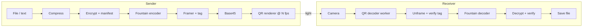

# ARCHITECTURE: LumenLink

## 1. System overview



Key property: **one-way, lossy, unordered channel.** Correctness never depends on feedback.

## 2. Layer model

| # | Layer | Responsibility | Spec'd in |
|---|---|---|---|
| 5 | App / UI | Send, Receive, Link Lab, settings | §8 |
| 4 | Container | Manifest (name, mime, size, SHA-256) + payload, optional compression | §4 |
| 3 | Security | KDF / key agreement, AES-256-GCM, per-frame tag | §6 |
| 2 | Fountain | LT code with systematic prefix | §5 |
| 1 | Framing | Binary frame header, tag, Base45 | §3 |
| 0 | Optical | QR render and scan | §7 |

## 3. Frame format (v1)

Binary, big-endian, before Base45 encoding.

| Offset | Len | Field | Notes |
|---:|---:|---|---|
| 0 | 1 | `ver_flags` | high nibble = version (1); low nibble flags: bit0 encrypted, bit1 compressed, bit2 repeat-mode (see §5), bit3 reserved |
| 1 | 8 | `session_id` | random; also the KDF salt; groups frames of one transfer |
| 9 | 4 | `container_len` | bytes of the container (post compress/encrypt) |
| 13 | 2 | `symbol_size` | S; `k = ceil(container_len / S)` |
| 15 | 4 | `seq` | droplet index; `seq < k` ⇒ systematic (raw symbol `seq`) |
| 19 | S | `symbol` | XOR of selected source symbols |
| 19+S | 8 | `tag` | encrypted mode: HMAC-SHA256 truncated to 8 B over bytes 0..19+S (key from HKDF of session key, label `frame`). Plaintext mode: truncated SHA-256 (noise integrity only) |

Overhead ≈ 27 B/frame. Last source symbol is zero-padded; `container_len` trims it.

**Why Base45 (ADR-001):** QR alphanumeric mode is dense, and Base45 (RFC 9285) is safe through every decoder.
Raw byte mode is slightly denser but many JS decoders mangle binary payloads. Benchmark both in Phase 2; keep Base45 unless raw bytes win clearly *and* decode correctly on all targets.

**Capacity planning (hypotheses, to be measured):** QR version ≈ 20–25 at ECC L/M gives roughly 600–1,000 usable
bytes/frame. At 8–12 fps, theoretical ceiling is single-digit KB/s; expect **~1–5 KB/s effective** after
overhead, aliasing and misses.

## 4. Container

```
plaintext container  = u16 manifest_len | manifest_json | file_bytes          (optionally zstd/deflate compressed)
encrypted container  = nonce(12) | AES-256-GCM( plaintext container ) | gcm_tag(16)
manifest             = { name, mime, size, sha256, created, v }
```
- Compression is **optional and user-disableable** (flag bit1). Disable it for highly sensitive data to avoid length leakage.
- Filename sanitised on receive (strip path separators, control chars, length cap).
- Decompression bounded by `manifest.size` and a hard cap. Mismatch ⇒ abort (decompression-bomb defence).

## 5. Fountain code (LT, systematic)

- **Systematic prefix:** frames `0..k-1` carry source symbols verbatim. A clean first pass needs zero repair.
- **Repair droplets:** for `seq ≥ k`, degree `d` drawn from a **robust soliton** distribution (c≈0.1, δ≈0.5, tune in Phase 1);
  neighbours = `d` distinct source indices.
- **Determinism (critical):** `(session_id, seq)` → seed via FNV-1a 32; PRNG = `mulberry32` (integer ops only);
  degree via lookup in a **fixed-point (u32) CDF table** generated once and checked into `vectors/`.
  Neighbours by partial Fisher–Yates using the same PRNG. Receiver regenerates neighbour sets, so no index lists are transmitted.
- **Decoder:** peeling first. When it stalls, fall back to **GF(2) Gaussian elimination** over the remaining
  unknowns (inactivation-lite) to cut overhead. Bounded by `k ≤ K_MAX` (default 2,048).
- **Repeat-mode (bit2):** same frame format, but there are no repair droplets; frame `seq` carries source symbol `seq mod k`. This is the naive baseline *and* the shipping fallback if it wins, so no format change is needed either way.
- **Control baseline (ADR-002):** a naive "repeat the k chunks in a loop" sender ships first. The fountain code
  must beat it on measured time-to-complete or it is dropped. RaptorQ/Wirehair are the fallback if LT overhead is poor at small k.

## 6. Security design

> **MVP caveat:** until Phase 5 lands, builds may run plaintext with only the noise-integrity tag. They are demo builds, not secure transfer.

**Threat model in one line:** the attacker can see and record the screen, can inject their own frames, and may hand
you a malicious file. They cannot read your device memory.

| Mode | Key establishment | Status |
|---|---|---|
| A. Passphrase | PBKDF2-SHA256 (≥600k iterations) with `session_id` salt → AES-256-GCM. **Generate a high-entropy passphrase (e.g. 6 diceware words)**; never let users type weak ones without a warning | v1 |
| B. Receiver-key (two-way) | Receiver shows an X25519 public key QR first; sender encrypts to it (ECDH → HKDF). No shared passphrase to brute-force | v1.1 stretch |
| C. Plaintext | Explicit opt-in, loud warning | v1 |

Why B matters: in mode A an attacker who films the stream can brute-force a weak passphrase **offline**.

Defences built in:
- **Per-frame tag** stops injected or poisoned droplets from corrupting the XOR solve (a single bad droplet with a valid CRC would otherwise fail the whole GCM check with no way to locate it).
- **Resource caps:** `k ≤ K_MAX`, one active session; new `session_id` mid-stream requires user confirmation.
- **Receiver hygiene:** never auto-open; show name/size/hash; sanitise filename; bounded decompression.
- **Web:** strict CSP, no third-party scripts, no analytics, SRI on any asset, no network calls after install.

## 7. Optical layer

- **Render:** canvas, integer module scaling, quiet zone ≥4 modules, dark-on-light with max contrast, `image-rendering: pixelated`.
- **Scan (web):** `BarcodeDetector` fast path where available; **zxing-wasm in a Web Worker** otherwise (Safari/Firefox).
  Frame skipping if the worker is busy so the UI never janks.
- **Scan (Python):** OpenCV capture + `zxing-cpp`/`pyzbar`.
- **Known physical hazards:** display refresh vs camera FPS beat patterns, rolling shutter banding,
  moiré, auto-exposure/focus hunting, glare. The fountain code absorbs lost frames; sender must keep each frame on screen for ≥2 camera frames
  (configurable hold time).
- **Stretch:** YOLO-based QR localiser/cropper ahead of the decoder for hard conditions.

## 8. UI architecture

**Screens**
```
┌─ SEND ───────────────────────────┐   ┌─ RECEIVE ────────────────────────┐
│ [Choose file] / [Paste text]     │   │  ┌────────── camera ──────────┐  │
│ Security: (•)Passphrase ( )None  │   │  │        [viewfinder]        │  │
│ Passphrase: correct-horse-...    │   │  └────────────────────────────┘  │
│ Density ▢▣▢  FPS ▢▣▢  Hold 2f    │   │  Symbols ▓▓▓▓▓▓░░░░░░  212/340    │
│ ┌──────────── QR ────────────┐   │   │  Frames seen 612 · dup 71 · bad 3 │
│ │          [animated]        │   │   │  ETA ~14 s     Session a3f9…      │
│ └────────────────────────────┘   │   │  Integrity: verifying…            │
│ Loop 2 · 340 frames · ⏸ ▶        │   │  [Save file] (after verified)     │
└──────────────────────────────────┘   └───────────────────────────────────┘
        LINK LAB: send known payload, measure success/time/KB/s, export JSON
```

**Receiver state machine**
`IDLE → ARMED (camera on) → LOCKED (session detected) → RECEIVING → VERIFYING → DONE | FAILED(reason)`
Transitions are pure functions in `codec/`; the UI only renders state. Decoder runs in a worker; messages are typed.

**Safety UX:** photosensitivity warning on first Send; configurable FPS cap (default ≤ 10 fps), brightness-dim and "reduce flashing" option.

## 9. Testing strategy

| Level | What |
|---|---|
| Unit | Base45, framing, PRNG, CDF table, KDF, container |
| Property-based (hypothesis / fast-check) | Drop random frames, duplicate, reorder, bit-flip ⇒ file reconstructs or fails cleanly, never silently corrupts |
| Simulator | Channel model (random + burst loss, dup, reorder); overhead ε curves for k ∈ {50…2000} |
| Conformance | `vectors/*.json` consumed by both Python and TS; CI fails on any byte mismatch |
| E2E | Playwright with fake camera stream (video file of the QR animation, optionally degraded with blur/noise/perspective) |
| Field | Real device-pair matrix, 20 trials per cell, raw CSV committed |
| Security | Fuzz frame parser; malformed headers; oversized `k`; decompression-bomb fixture |

## 10. CI/CD and deployment
GitHub Actions: `ruff` + `mypy` + `pytest` · `eslint` + `tsc` + `vitest` · conformance · Playwright E2E · build · deploy static site to S3 + CloudFront (or Pages) on tag. Dependabot, `pip-audit`, `npm audit`. Lighthouse PWA check.

## 11. Performance budget
Decode loop ≥ 15 camera frames/s on a mid-range phone, main-thread jank < 50 ms, first load < 500 KB gzipped (zxing-wasm lazy-loaded), offline after first load.

## 12. ADR index
| ADR | Decision | Status |
|---|---|---|
| 001 | Base45 over raw bytes | Proposed; benchmark in Phase 2 |
| 002 | LT + GF(2) fallback; naive-loop control baseline | Proposed; kill criterion in RISKS |
| 003 | Browser-first (PWA), Python as reference/CLI | Accepted |
| 004 | Dual implementation with conformance vectors | Accepted |
| 005 | Per-frame authentication tag | Accepted |
| 006 | No backend, no telemetry | Accepted |
| 007 | Receiver-key (ECDH) mode as the recommended secure path | Proposed (v1.1) |
